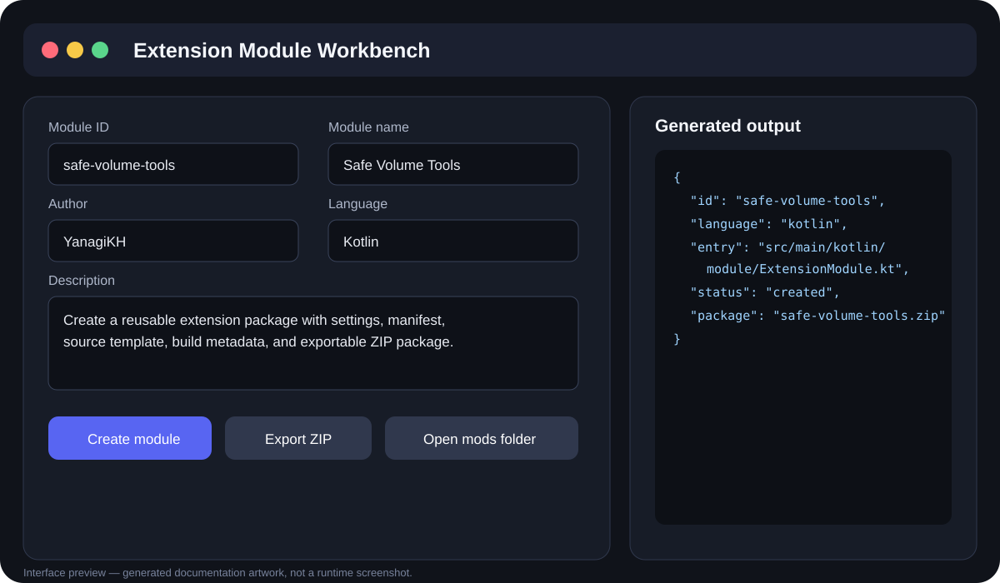
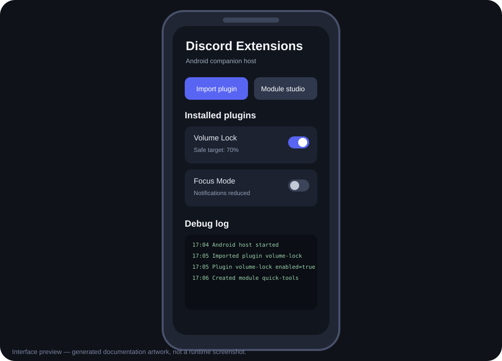
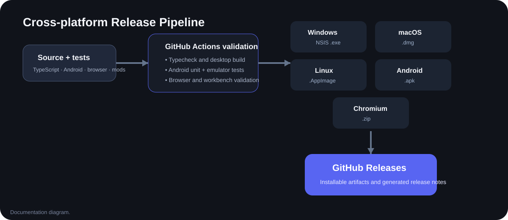

<div align="center">
  <picture>
    
  </picture>

[English](README.md) / [繁體中文](README_ZH.md) / [日本語](README_JP.md)

[](https://github.com/YanagiKH/Discord-Extensions/actions/workflows/ci.yml)
[](https://github.com/YanagiKH/Discord-Extensions/actions/workflows/android.yml)
</div>

# Discord Extensions

<!-- section:overview -->
Discord Extensions は、Discord 関連のワークフロー向けクロスプラットフォームコンパニオンおよび拡張モジュールホストです。Electron デスクトップコントロールパネル、Chromium Manifest V3 コンパニオン、Kotlin と Java で実装した Android 8.0+ ネイティブアプリを提供します。

> [!CAUTION]
> これは実験的なコミュニティプロジェクトであり、Discord 公式のプラグインシステムではありません。本プロジェクトは独立したコンパニオンとして動作し、Discord のインストールディレクトリを変更したり、公式アプリへコードを注入したりしません。

<!-- section:architecture -->
## 採用しているアーキテクチャ

- 永続設定、トレイ起動、シングルインスタンス、プラグイン取り込み、独立したモジュールワークベンチ画面を備える Electron + TypeScript デスクトップホスト。
- Activity とリポジトリを Kotlin、manifest 検証とデバッグログ保存を Java で実装した Android ネイティブアプリ。
- Discord Web の UI 調整とクイック操作向け Chromium Manifest V3 ブラウザコンパニオン。
- 設定、権限、言語、runtime、build メタデータ、tool/panel ホストモードを含む共有 `plugin.json` 契約。
- `mods/` モジュール規約と JavaScript、TypeScript、Java、Kotlin のワークベンチテンプレート。
- Python、Go、Rust、C、C++ の既存ツール型プラグイン例。
- TypeScript、デスクトップビルド、Android 単体テスト、Android 8.0 エミュレータ起動、ブラウザ拡張構造、モジュールテンプレート、ネイティブ言語サンプルを検証する GitHub Actions。
- Windows NSIS `.exe`、macOS `.dmg`、Linux `.AppImage`、Android `.apk`、Chromium `.zip` を作成する Release マトリクス。

<!-- section:previews -->
## インターフェースプレビュー

以下はドキュメント用の UI プレビューであり、実行時スクリーンショットではありません。

### デスクトップモジュールワークベンチ



### Android コンパニオンホスト



### Release パイプライン



<!-- section:features -->
## 対応機能

### デスクトップホスト

- インストール済みプラグインの有効化／無効化。
- 詳細パネルからトグル、範囲、テキスト、選択設定を編集。
- フォルダ、`.zip` パッケージ、`plugin.json` manifest の取り込み。
- プラグイン状態と設定をローカルアプリワークスペースへ保存。
- 英語、繁體中文、日本語の UI 切り替え。
- 自動起動、非表示起動、トレイ動作、コンパクト表示、文字サイズの設定。
- プラグインワークスペースと生成された `mods/` ディレクトリへのアクセス。

### Android ホスト

- Android 8.0 以上（`minSdk 26`）。
- Android のシステムドキュメントピッカーから `plugin.json` または `.zip` を取り込み。
- 広範なストレージ権限を要求せず、アプリ専用ストレージへ保存。
- インストール前に Java でモジュール ID と必須 manifest フィールドを検証。
- 取り込んだモジュールの有効／無効状態を保存。
- システムブラウザで Discord Web を開く。
- アプリ内デバッグログを表示。
- 端末言語に応じて英語、繁體中文、日本語を使用。

### ブラウザコンパニオン

- コンパクトレイアウト制御。
- 文字サイズとサイドバー幅の制御。
- モーション軽減モード。
- 任意の Discord Web ページ整理設定。
- `chrome.storage.local` による設定の永続化。

### 組み込み／サンプルプラグイン

- Volume Lock
- Voice Comfort
- Focus Mode
- Quick Launcher
- Compact Sidebar
- Python Voice Guard
- Go Quick Actions
- Rust Safe Speaker
- C Voice Guard
- C++ Compact Sidebar

<!-- section:workbench -->
## 拡張機能モジュールワークベンチ

デスクトップ版と Android 版には、新しい拡張機能の定型作業を減らすモジュールワークベンチが含まれます。

1. モジュール ID、表示名、作成者、説明、カテゴリを入力します。
2. JavaScript、TypeScript、Java、Kotlin のいずれかを選択します。
3. モジュールを作成します。ワークベンチは `plugin.json`、入口ソース、モジュール README、必要な言語別ビルドファイルを書き出します。
4. ローカル `mods/` ディレクトリを開くか、生成モジュールを `.zip` として書き出します。
5. 配布前に対象言語の検証／ビルドコマンドを実行します。

生成パッケージの構造：

```text
mods/my-extension/
├─ plugin.json
├─ README.md
├─ src/
│  └─ ... 入口ソース ...
└─ 任意の言語別ビルドファイル
```

`plugin.json` が互換性の境界です。JavaScript、TypeScript、Java、Kotlin、Python、Go、Rust、C、C++ のソースを記述できますが、対象端末には必要な runtime／コンパイラが必要です。Android は任意のデスクトップネイティブバイナリを実行しません。

<!-- section:installation -->
## インストール方法

### 1. GitHub Releases

最新 Release から対象プラットフォームのファイルを取得します。

| プラットフォーム | パッケージ | インストール |
|---|---|---|
| Windows x64 | `Discord-Extensions-*.exe` | NSIS インストーラを実行します。 |
| macOS Intel / Apple silicon | `Discord-Extensions-*.dmg` | DMG を開いてアプリをコピーします。 |
| Linux x64 | `Discord-Extensions-*.AppImage` | 実行権限を付与して起動します。 |
| Android 8.0+ | `Discord-Extensions-Android-*.apk` | 選択したファイル提供元からのインストールを許可して APK を導入します。 |
| Chrome / Edge / Brave | `Discord-Extensions-Chromium.zip` | 展開後、パッケージ化されていない拡張機能として読み込みます。 |

Release 生成物はコミュニティビルドです。デスクトップパッケージは未署名の場合があり、正式な署名シークレットが設定されていない場合、Android はインストール可能な debug 署名版です。実行前に本リポジトリ由来のファイルであることを確認してください。

### 2. Windows ワンクリックソース起動

1. Node.js 24 以上をインストールします。
2. リポジトリをダウンロードまたは clone します。
3. `start.bat` をダブルクリックします。
4. 不足する npm 依存関係を導入後、デスクトップホストが起動します。

### 3. デスクトップソースインストール

```bash
npm install
npm run typecheck
npm run validate:repo
npm run start:desktop
```

各 OS 上でインストーラを作成：

```bash
npm run dist:win
npm run dist:mac
npm run dist:linux
```

### 4. Android Studio インストール

1. Android Studio で `android/` ディレクトリを開きます。
2. JDK 17 を選択します。
3. Android SDK Platform 35 と Build Tools 35.0.0 を導入します。
4. Android 8.0+ の実機またはエミュレータで `app` 構成を実行します。

Gradle 8.10.2 のコマンドラインビルド：

```bash
gradle -p android clean testDebugUnitTest assembleDebug --stacktrace
```

APK 出力先：

```text
android/app/build/outputs/apk/debug/app-debug.apk
```

### 5. Chromium の未パッケージ導入

1. `chrome://extensions`、`edge://extensions` などを開きます。
2. デベロッパーモードを有効にします。
3. 「パッケージ化されていない拡張機能を読み込む」を選択します。
4. `browser-extension/` ディレクトリを選択します。
5. Discord Web を開き、フローティングパネルまたはツールバーポップアップを使用します。

### 6. プラグインパッケージ導入

- デスクトップ：**Import plugins** からフォルダ、`.zip`、`plugin.json` を選択します。
- Android：**プラグインを読み込む** からシステムピッカーで `.zip` または `plugin.json` を選択します。
- 取り込み後のモジュールは既定で無効になり、ホスト UI から有効化できます。

<!-- section:release -->
## Release と検証ワークフロー

- `ci.yml` はデスクトップホスト、ワークベンチ、ブラウザコンパニオン、Android 構造、Android 単体テスト、ネイティブ言語例を検証します。
- `android.yml` は APK の作成、単体テスト、Android 8.0 エミュレータ起動、instrumentation テスト、UI／ログ証拠のアップロードを行います。
- `release.yml` は `v*` タグまたは手動実行で全パッケージを作成し、1 つの Release ジョブへ集約して GitHub Releases に公開します。

手動 Release：

1. **Actions → Release → Run workflow** を開きます。
2. `v0.2.0` などのタグを入力します。
3. Windows、macOS、Linux、Android、ブラウザの全ジョブ完了を待ちます。
4. 告知前に Release とダウンロードファイルを確認します。

<!-- section:debug -->
## デバッグマニュアル

### デスクトップ起動／空白画面

```bash
npm install
npm run typecheck
npm run validate:workbench
npm run build
npm run dev
```

- ターミナルの Electron メインプロセスと Vite renderer エラーを確認します。
- **Open data folder** でアプリワークスペースを開きます。
- `state.json` または `app-settings.json` を一時的に改名し、保存状態の破損を確認します。
- 別インスタンスがシングルインスタンスロックを保持していないか確認します。
- Linux では `chmod +x Discord-Extensions-*.AppImage` を実行します。

### プラグイン取り込み失敗

- パッケージ内に読み取り可能な `plugin.json` があることを確認します。
- 必須項目は `id`、`name`、`version`、`description`、`author`、`entry`、`permissions`、`settings` です。
- ID は小文字、数字、`.`、`_`、`-` のみを使用します。
- ZIP パスがパッケージディレクトリ外へ出ないことを確認します。
- 展開後に宣言された入口ファイルが存在することを確認します。
- ネイティブ言語ツールには対応 runtime／コンパイラが必要で、Android では自動実行されません。

### Android ビルド／実行

```bash
gradle -p android clean testDebugUnitTest assembleDebug --stacktrace
adb install -r android/app/build/outputs/apk/debug/app-debug.apk
adb shell am start -W -n io.yanagikh.discordextensions.debug/io.yanagikh.discordextensions.MainActivity
adb logcat -d '*:E'
```

- JDK 17、Gradle 8.10.2、Android Platform 35、Build Tools 35.0.0 を使用します。
- エミュレータ検証は API 26 以上で行います。
- 更新をインストールできない場合、異なる開発署名の旧版を削除してから再導入します。
- Android のデバッグイベントはアプリ内に表示され、`adb logcat` は主にプラットフォームクラッシュ確認用です。
- 広範な外部ストレージ権限は要求しないため、システムドキュメントピッカーを使用します。

### ブラウザ拡張の問題

```bash
npm run validate:browser-extension
```

- ファイル編集後に未パッケージ拡張を再読み込みします。
- 拡張管理ページから service worker を確認します。
- 対象タブが `https://discord.com/` であることを確認します。
- 既定値テスト時は拡張のローカルストレージを消去します。
- Discord Web の class 名変更によりページ整理セレクタの保守が必要になる場合があります。

### GitHub Actions の問題

- 失敗ジョブを開き、ソース検証、パッケージ化、Android Gradle、エミュレータ起動、Release アップロードのどこで失敗したか確認します。
- 依存関係や runner イメージの変更を確認してから再実行します。
- Android 単体テストレポートとエミュレータ証拠を利用します。
- 全パッケージジョブ成功後のみ Release が公開されます。

<!-- section:development -->
## 主な開発コマンド

```bash
npm run start:desktop
npm run build
npm run typecheck
npm run validate:repo
npm run validate:workbench
npm run validate:browser-extension
npm run validate:android
```

<!-- section:security -->
## セキュリティ境界

- デスクトップアプリと Android アプリは独自のローカルワークスペースを使用します。
- ブラウザ側は Discord Web に限定したホスト権限を持つ明示的な Manifest V3 拡張です。
- Android の取り込みは Storage Access Framework とアプリ専用ストレージを使用します。
- 公式 Discord 実行ファイル、インストールディレクトリ、プラットフォーム保護を変更／回避せず、公式クライアントへコードを注入しません。
- 有効化前に第三者モジュールのソースと権限を確認してください。
